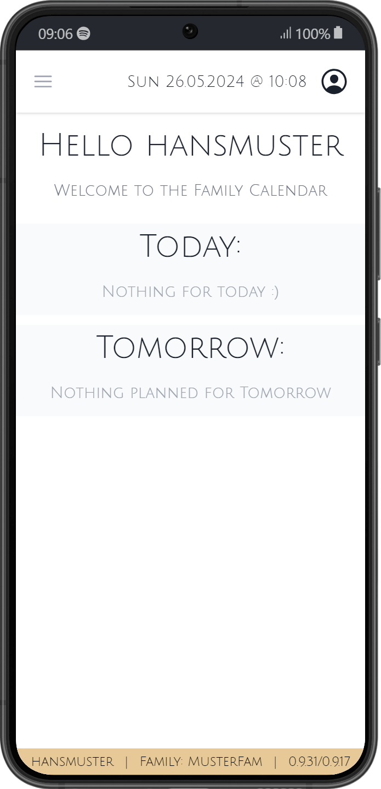
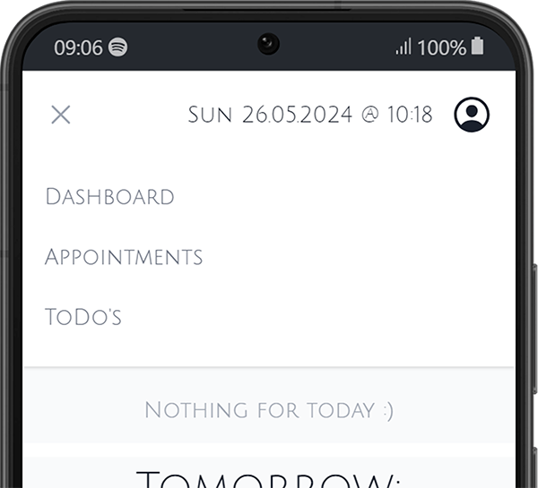
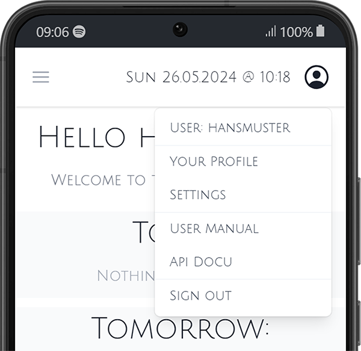

# Dashboard

The dashboard (or /home) displays today's and tomorrow's appointments in a user-friendly manner.

:::info Filter
All family appointments are displayed in the dashboard, not filtered by family user. Filter will be added later
:::

## Header 

the header is composed of : 
- Navigation (left)
- Current date and time (middle)
- User menu (right)

#### Navigation

Three options are available:
- Dashboard (the current page)
  - Today's and Tomorrow's appointments 
- Appointments
  - all Family appointments for the current and the next month.
- ToDo's
  - All overdue Tasks
  - All current Tasks

#### User menu

- Your Profile
  - Info about yourself (this is more for debug purposes)
- Settings
    - See and create new `Tags` 
    - See and create new `Personas`
    - See details and create `Invitation Codes` for the Family (only if the user is Family Admin)
- Debug (only for Server Admin Role)
- User Manual
    - Opens a new tab to the current User Manual
- API Docu
    - Opens a new tab to the API (Backend) documentation
- Sign out
    - Signs the user out 

## Footer
the footer shows debug information about the system and the logged in User. 
`Username | Current Family | Versions frontend/backend`

Clicking on the Version numbers, opens the Manual page with all the release notes and Version information.

:::info Footer
The footer will be removed in v1.0.0
:::