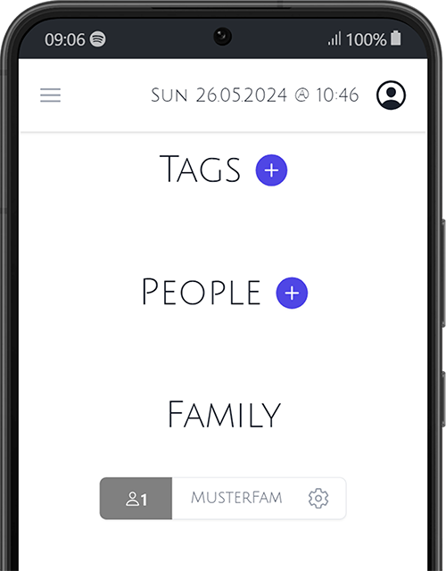

# Settings

The Settings page gives access to the `Tags` , the `People` and the `Family` Details

## Tags 
Tags are used to categorize Appointments and Task.
:::info Tags
You can create and assign tags, but they are not yet used in the frontend. They can be used in the API.
:::

#### Create Tags
