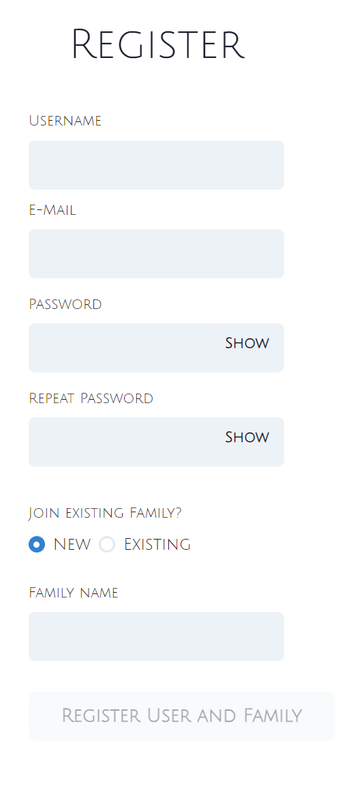

# Signup and Login

# Signup

To join the Family Calendar app for the first time, you need to register. This can be done here : https://app.famcal.ch/registration 

The Following fields have to be provided: 

`username` this will be used to login to the app. Case-Sensitive

`email` this will be used in future to send confirmation mails, reminders and password reset requests.

`password` used to identify the user. Min 6 characters long

Then you will have to select if you are going to create a new family, or if you will join an existing one. 

`new` means the family is not yet created. Enter the to be created Family name.

`existing` joins an existing Family by providing an invitation code.

:::warning
Joining Existing Family is not yet implemented. To add a user to the Family, a DB interaction is needed.
:::

:::info Login
after the creation of the new user and family, the user is automaitically logged in
:::
:::warning E-Mail
The Email is not verified during signup
:::