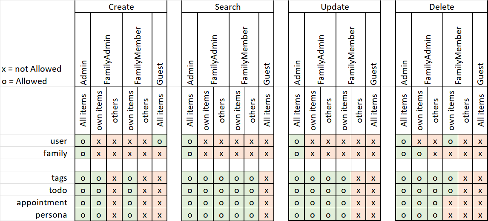

## workflow

to use the app, at least a user and a family is needed 

1. Create a user[^1]
2. Create a Family[^1]
   1. automatically creating `createdBy` value
   1. need to define at least one `familyAdmin` (`uuid` of the admin user.)
   1. the creating user is added as `familyAdmin` at creation.

## Permissions
[

- [Calendar](Calendar)
- [People](People)
- [Tags](Tags)
- [Todo's](Todo)
- [Users](users)
- [Family](Family)

## Tags
See [Tags](Tags) details.

A tag is related to a family.

#### Creating item
Tags can only be created if the following is true:
- user `isAdmin`  OR  user is `familyAdmin` OR user is `familyMember`in the family linked to the tag
- a familyUuid is provided at creation (in dev it's provided as http header `session_familyUuid`
#### Searching items
Every logged in `familyMember` can search for and use tags
#### Updating items
#### Deleting items
Tags can only be deleted if the following is true:
- user `isAdmin`  OR  user is `familyAdmin` OR is the `creator` in the family linked to the tag
- a familyUuid is provided at creation (in dev it's provided as http header `session_familyUuid`

## Todo's
See [Todo](Todo) details.

A Todo is related to a family.

#### Creating item
Todo can only be created if the following is true:
- user `isAdmin`  OR  user is `familyAdmin` OR user is `familyMember`in the family linked to the tag
- a familyUuid is provided at creation (in dev it's provided as http header `session_familyUuid`
#### Searching items
Every logged in `familyMember` can search for and use todo's
#### Updating items
#### Deleting items
Todos can only be deleted if the following is true:
- user `isAdmin`  OR  user is `familyAdmin` OR is the `creator` in the family linked to the tag
- a familyUuid is provided at creation (in dev it's provided as http header `session_familyUuid`

## Persona
See [People](People) details.

A Persona is related to a family.
#### Creating item
Persona's can only be created if the following is true:
- user `isAdmin`  OR  user is `familyAdmin` OR user is `familyMember`in the family linked to the tag
- a familyUuid is provided at creation (in dev it's provided as http header `session_familyUuid`
#### Searching items
Every logged in `familyMember` can search for and use Persona's
#### Updating items
#### Deleting items
Personas can only be deleted if the following is true:
- user `isAdmin`  OR  user is `familyAdmin` in the family linked to the tag
- a familyUuid is provided at creation (in dev it's provided as http header `session_familyUuid`

## Appointment
See [calendar](Calendar) details.

An Appointment is related to a family.
#### Creating item
Appointments's can only be created if the following is true:
- user `isAdmin`  OR  user is `familyAdmin` OR user is `familyMember`in the family linked to the tag
- a familyUuid is provided at creation (in dev it's provided as http header `session_familyUuid`
#### Searching items
Every logged in `familyMember` can search for and use Appointments
#### Updating items
#### Deleting items
Appointments can only be deleted if the following is true:
- user `isAdmin`  OR  user is `familyAdmin` in the family linked to the tag
- a familyUuid is provided at creation (in dev it's provided as http header `session_familyUuid`

[^1]: Currently users and families are created manually. WIll be implemented shortly